🎬 CINEMAX (MovieApp)

Cinemax uygulaması; React Native CLI kullanılarak geliştirilmiş, TypeScript tabanlı modern bir mobil film keşif uygulamasıdır.
Firebase tabanlı backend altyapısı ve API entegrasyonu ile, popüler ve güncel filmleri keşfetme ve izlenecek filmleri kaydetme imkânı sunar.

## Özellikler

- 🔐 **Firebase Authentication** – E-posta/şifre ile kullanıcı giriş & kayıt işlemleri yapılmıştır.
- 🎞️ **TMDB API** – Popüler, gündem ve türlerine göre film listelerini çekme işlemi içindir.
- 📌 **Watch Later (Sonra İzle)** – Filmleri kaydetme ve sonra izleme listesidir.
- 🔍 **Arama** – Film isimlerine göre arama özelliği sunar.
- 🌓 **Temiz UI** – Modern ve sade tasarım sunar.

## 🛠️ Kullanılan Teknolojiler

- [React Native CLI](https://reactnative.dev/)  
- [TypeScript](https://www.typescriptlang.org/)  
- [Firebase](https://firebase.google.com/) (Auth + Firestore/Realtime DB/Storage)  
- [TMDB API](https://developer.themoviedb.org/)  
- [React Navigation](https://reactnavigation.org/)  
- [react-native-vector-icons](https://github.com/oblador/react-native-vector-icons)  
- Çevre değişkenleri için `react-native-dotenv`  

## 📸 Ekran Görüntüleri

## SplashScreen
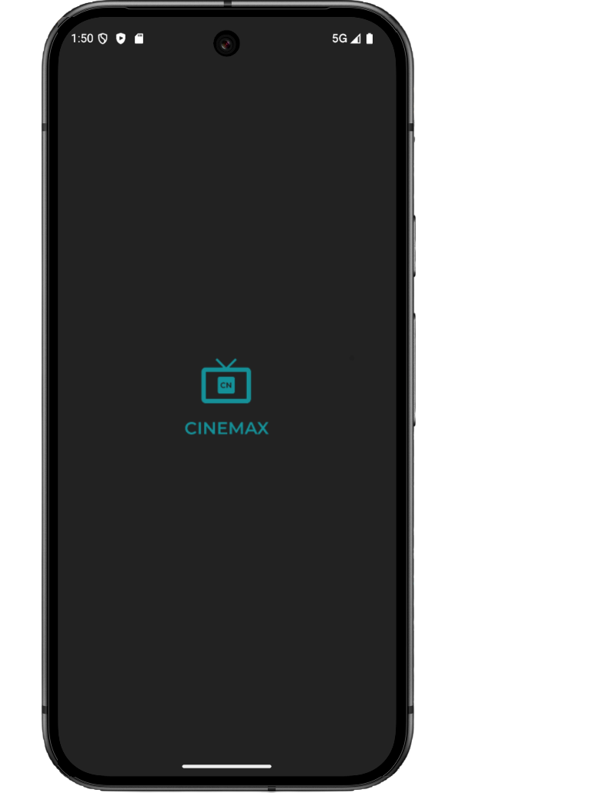 

## Onboarding 

 

 
 

## Login Screen

 

 
 

## Home Screen

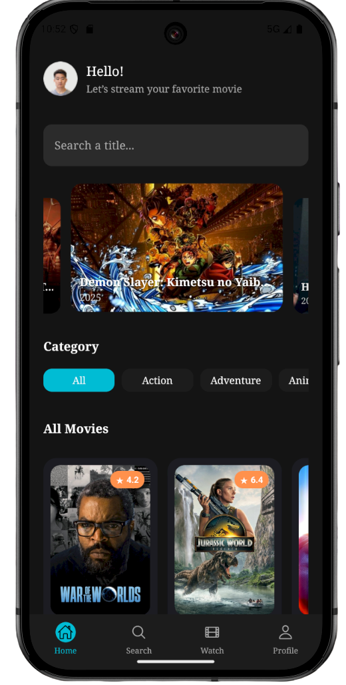 
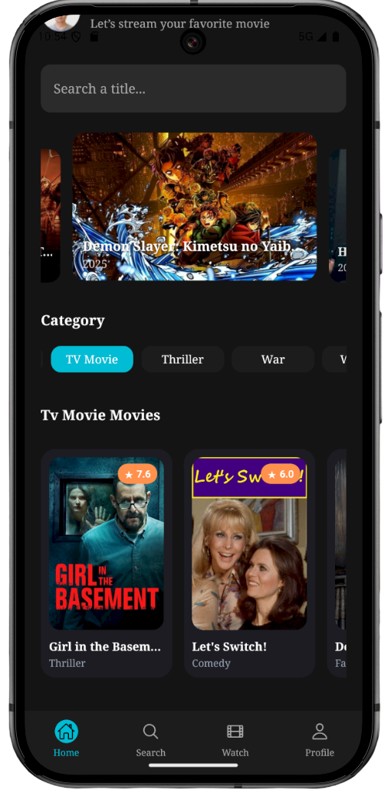
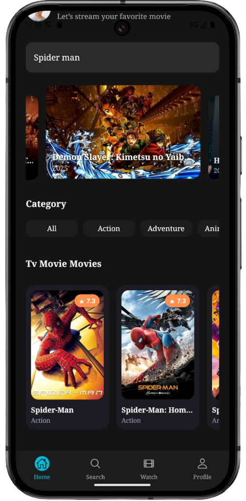 

## Movie Detail 

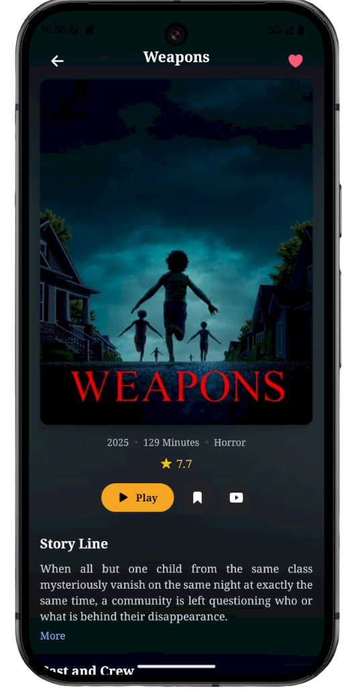 

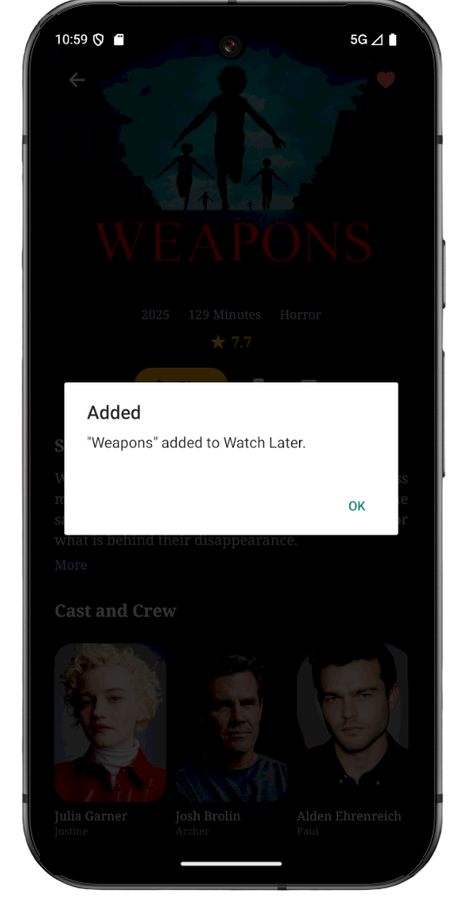 

## Search Screen

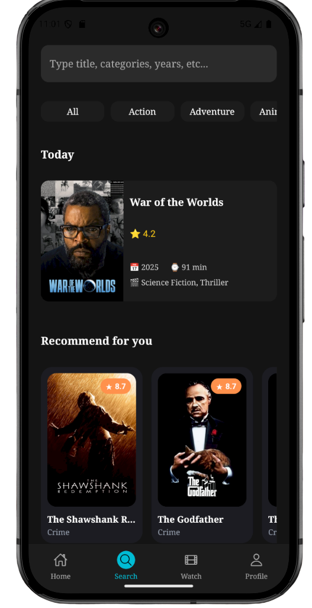 

## Watch Later Screen

 

## Profile Screen

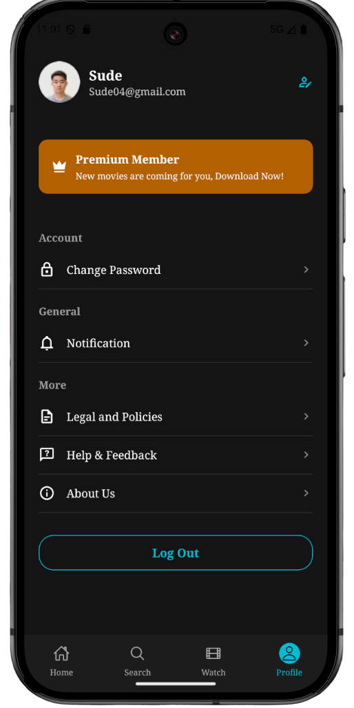 
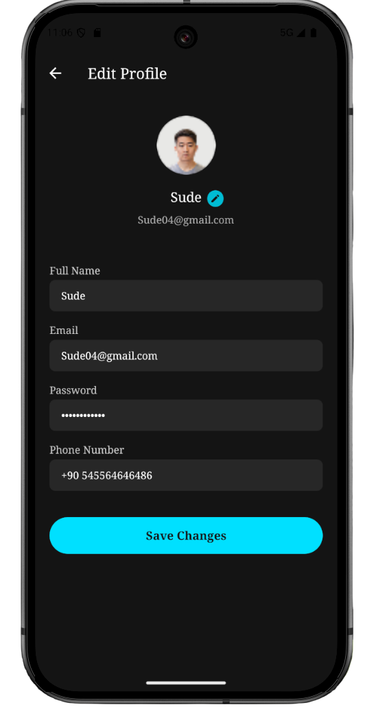
 
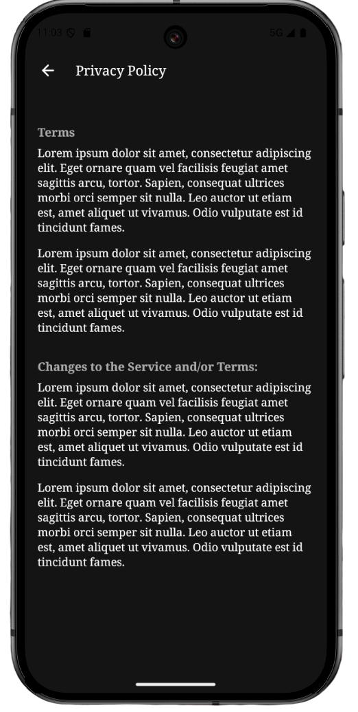 
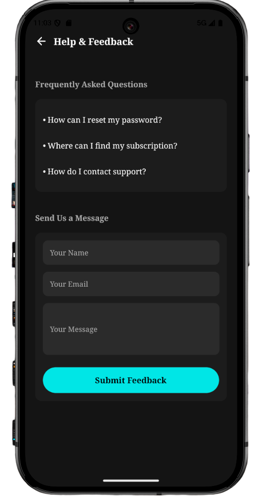 

